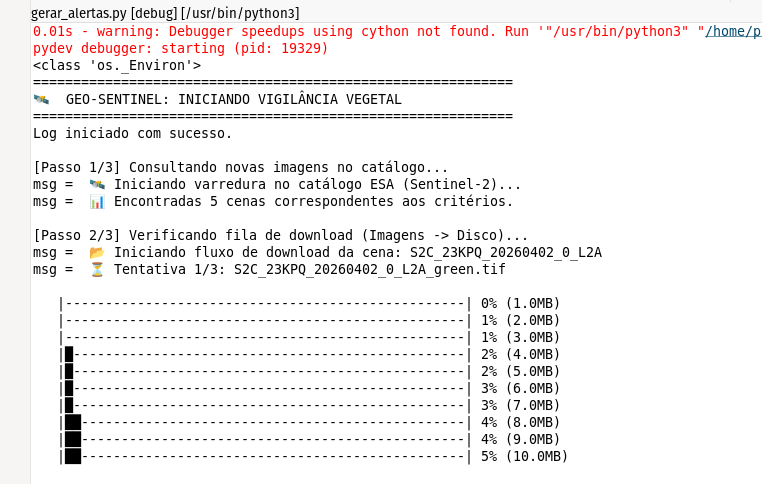
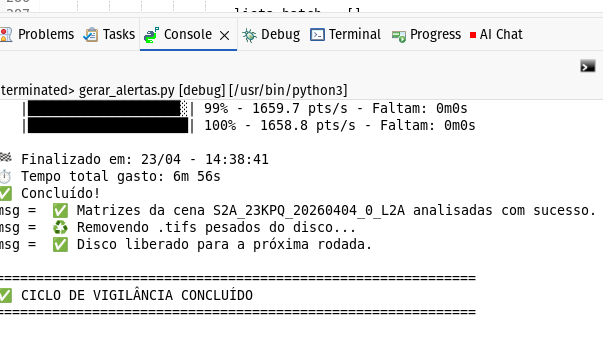
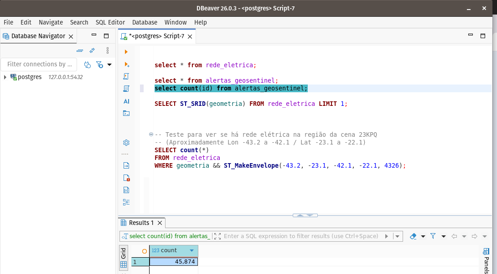
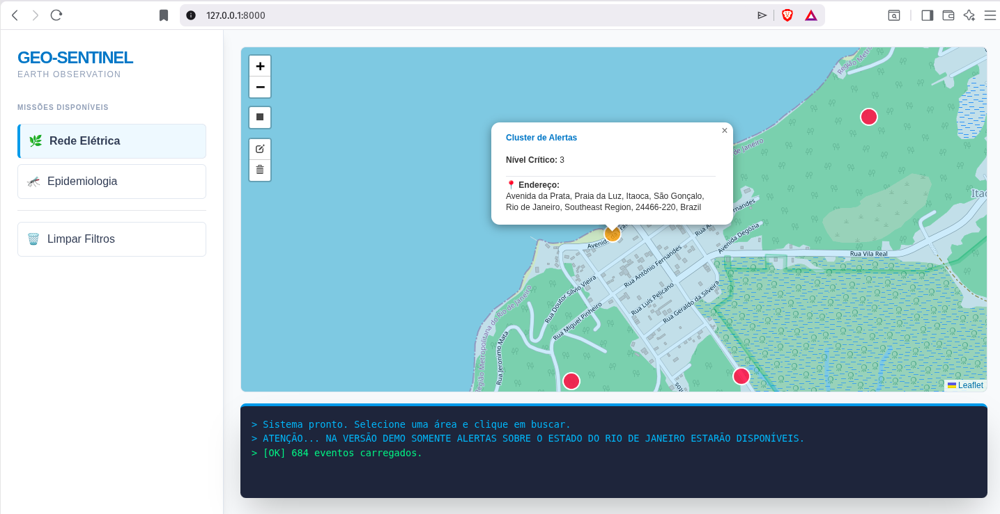
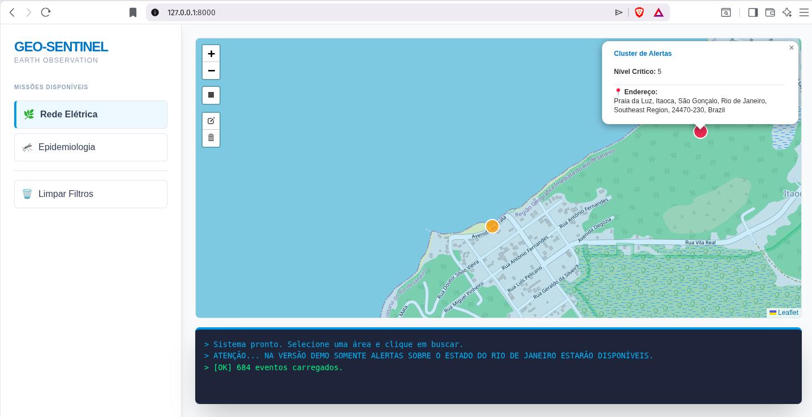

# Geo-Sentinel 🛰️⚡

**Geo-Sentinel** is an automated geospatial intelligence system designed to monitor and protect electrical infrastructure through satellite imagery and advanced spatial analysis. By cross-referencing high-resolution satellite data with electrical grid assets, it identifies vegetation encroachment risks in real-time.

> "Geo-Sentinel: A fully open-source, self-hosted geospatial intelligence engine. No proprietary clouds, no hidden licenses. Built on Linux, powered by PostGIS, dedicated to the freedom of information."

## 📺 Technical Demo & Walkthrough
**Coming Soon!** 🎬

The source code is now officially registered and public here on Hugging Face. I am currently finalizing a detailed video demonstration on my YouTube channel, where I'll show the system running on bare metal, processing real satellite scenes, and managing grid alerts in real-time.

**Subscribe to stay tuned:**
👉 [YouTube Channel: @Embodied_AI](https://www.youtube.com/channel/UCWEOGrUlPA3JpQLZ7j7x5lw)

## 🔬 Core Technical Focus
This project is a deep-dive into **Computer Vision (CV) from scratch** and **Remote Sensing**, moving beyond simple high-level APIs to handle:
* **Multispectral Image Processing**: Direct manipulation of satellite bands (Red, Green, NIR) to calculate environmental indices.
* **Remote Sensing Techniques**: Implementation of NDVI (Vegetation) and NDWI (Water) logic for automated feature extraction.
* **Raw Computer Vision**: Pixel-level matrix operations and spatial analysis without proprietary black-box software.

## 🌟 Core Concept
The project solves the "last mile" problem of utility maintenance through a Robotic Process Automation (RPA) approach:
1.  **Ingest**: Processes complex geospatial data (GDB/ArcGIS) from utility providers like ANEEL.
2.  **Monitor**: Tracks regions using CBERS-4A satellite imagery from INPE.
3.  **Detect**: Identifies vegetation risks using NDVI and NDWI algorithms.
4.  **Alert**: Pinpoints GPS coordinates where vegetation is within a critical 10m radius of power lines.

## 🛠️ Technical Stack
* **Backend**: Python 3.10+ (FastAPI / Jinja2 / HTMX).
* **Database**: PostgreSQL + PostGIS (Spatial indexing & proximity queries).
* **Imagery**: Rasterio & NumPy for satellite matrix processing.
* **Data Sources**: INPE STAC Catalog (Satellite) and ANEEL Open Data (Grid).

Location for obtaining public data on medium and low voltage overhead power lines: https://dadosabertos-aneel.opendata.arcgis.com/search?tags=distribuicao

## 📁 Project Structure
* **`Configuracores.py`**: Central system configuration and environment settings.
* **`Controller/`**: Contains the core logic, including GDB extraction and vegetation risk calculation (`Vegetal_Controller.py`).
* **`DataBase/`**: Complete infrastructure for PostGIS, including initialization scripts (`geo_sentinel_init.sql`) and a custom backup/restore engine (`restaurar_backup.sh`).
* **`gerar_alertas.py`**: The main engine for satellite monitoring and alert generation.
* **`MainServiceWebAPI.py`**: The FastAPI-based web service for the digital showroom.
* **`setup_gdb.py`**: Script to initialize and populate the electrical grid mesh.
* **`Public_Files/` & `static/`**: Frontend assets and templates for the web interface.
.
├── Configuracores.py
├── Controller
│   ├── Controller_Extrator_GDB.py
│   ├── Geopoints_Controller.py
│   ├── __init__.py
│   ├── Master_Controller.py
│   └── Vegetal_Controller.py
├── DataBase
│   ├── backup_full_rebuild
│   │   ├── dados
│   │   ├── procedures
│   │   ├── tabelas
│   │   └── triggers
│   ├── DB_PostGres.py
│   ├── geo_sentinel_init.sql
│   ├── __init__.py
│   ├── postgis_full_rebuild_backup.py
│   ├── PostgresAtualizador.py
│   └── restaurar_backup.sh
├── gerar_alertas.py
├── MainServiceWebAPI.py
├── ModelCard.rtf
├── Public_Files
│   ├── 404.html
│   └── index.html
├── requirements.txt
├── setup_gdb.py
└── static
    └── imagens
        ├── 404-bandeirantes.png
        ├── bussola.png
        └── tutorial_preview.jpg

## 🚀 Quick Start
1. **Requirements**: Ensure a PostgreSQL + PostGIS instance is running. Install dependencies with `pip3 install -r requirements.txt`.
2. **Initialization**: Populate the grid mesh using `python3 setup_gdb.py`.
3. **Execution**: Start the surveillance engine with `python3 gerar_alertas.py`.

## 🛡️ Reliability & Resilience
* **Disaster Recovery**: Custom engine for granular SQL backups of tables and procedures.
* **Network Resilience**: Built-in retries and 300s timeouts for high-latency satellite APIs.
* **Performance**: Optimized pixel-skipping for efficient processing on Bare Metal Linux.

## 📜 License
This project is licensed under the **GNU General Public License v3.0**. 🐧
*Free Software for a free world.*

---

## 🚀 Optimization & Performance (Case Study: annunnaki)

Processing Sentinel-2 imagery involves analyzing millions of pixels. During development, we faced the challenge of cross-referencing **149,736 points of interest** with the electrical power grid using entry-level hardware (Core i3, 8GB RAM).

### Performance Evolution

| Version | Strategy | Estimated Time | Status |
| :--- | :--- | :--- | :--- |
| **v1.0** | Simple Loop + `::geography` | ~92 Hours | 🐌 Infeasible |
| **v2.0** | Batch Pagination + Checkpoints | ~15 Hours | 📈 80% Improvement |
| **v3.0** | GIST Index + Geometric Search | **~20 Minutes** | 🚀 High Performance |

### 🛠️ Engineering Decisions

To achieve these gains, we implemented several data engineering best practices:

1.  **Batch Processing (Pagination):** Instead of opening a database transaction for every single point, we grouped alerts into batches of 500 records. This drastically reduced I/O overhead and network latency between Python and PostGIS.
2.  **Persistent Checkpoints:** We implemented a tracking system in the database (`pontos_processados`). This allows the process to be interrupted and resumed without losing progress, ensuring resilience during overnight runs.
3.  **Geometry vs. Geography:** We replaced the heavy metric calculation (`::geography`) with direct geometric plane comparisons in degrees (`0.00015`). This optimization leverages the full power of PostgreSQL's GIST spatial indexing.
4.  **Hardware-Aware Benchmark:** The script performs an initial benchmark to assess hardware load at execution time, providing a realistic ETA (Estimated Time of Arrival) for the task completion.

---

## 🤝 Special Thanks
A huge shout-out to **Gemini**, an AI assistant who can be a bit "tangled" (enrolado) at times, but provided critical technical insights and helped navigate the complex spatial logic that makes Geo-Sentinel possible.

## ⚠️ Data Source Governance & Resilience
Working with public satellite catalogs (like INPE/BDC) requires a "fail-fast" and adaptive architecture.

* **API Stability**: Endpoints for STAC catalogs are subject to change without notice (e.g., transitions from `/stac` to `/v1`).
* **Availability**: High-latency providers can trigger **301 Redirects** or **504 Timeouts**.
* **Infrastructure Strategy**: Geo-Sentinel is built to handle these shifts via `Configuracores.py`, allowing quick URL updates without refactoring the core multispectral engine.

> **Notice**: If downloads are failing, verify if the provider has migrated their API version or required new access tokens. 🐧🛰️

## ⚠️ Architecture Decision Record (ADR): Migration from INPE to ESA
Initially, **Geo-Sentinel** was designed to use the Brazilian satellite CBERS-4A via the INPE/Brazil Data Cube STAC API. However, due to severe and persistent infrastructure instability (recurring internal server 500 errors, unannounced API discontinuations, and gateway timeouts), the provider was deemed unreliable for a production-level automated mechanism or even for our small research project.

To ensure high availability and resilience, the data source was migrated to the Sentinel-2 catalog from the **European Space Agency (ESA)**, accessed via the AWS Earth Search infrastructure. This ensures 10 m/pixel resolution with a highly stable API, proving that the Geo-Sentinel architecture is provider-agnostic and built to survive upstream failures.

## 🚀 Interface & Operation

Real-time operation logs showing everything from Sentinel-2 biomass detection to reverse geocoding of assets.

|  |  |  |
|:---:|:---:|:---:|
| Main Dashboard | Spectral Index Processing | Conflict Mapping |

|  |  |  |
|:---:|:---:|:---:|
| Server-side Logs | Vegetation Detection | Mission Filtering |

|  |  |  |
|:---:|:---:|:---:|
| GIS Visualization | Point-cloud Details | Reverse Geocoding |

---
**Footnote:** Due to the high computational overhead required to process the massive geospatial datasets this project handles, and out of deep respect for the **Hugging Face** community's shared resources, we have chosen *not* to activate live hosting (Spaces) here. Instead, we provide the complete **source code** and **database backup** for local deployment, honoring the principles of self-hosting and sovereign infrastructure. 🐧🛰️

#Geoprocessing 
#RemoteSensing 
#ComputerVision 
#GIS 
#PostGIS 
#Python 
#SatelliteImagery
